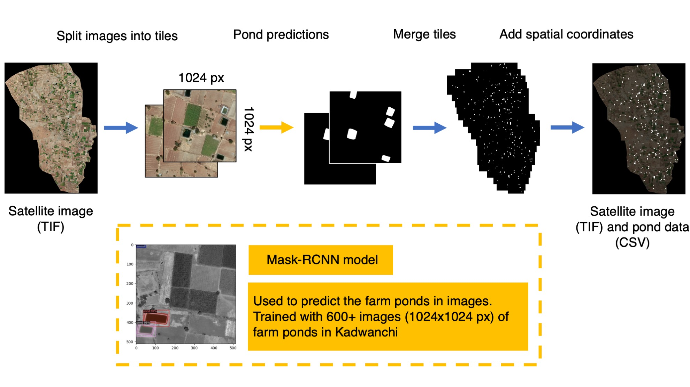
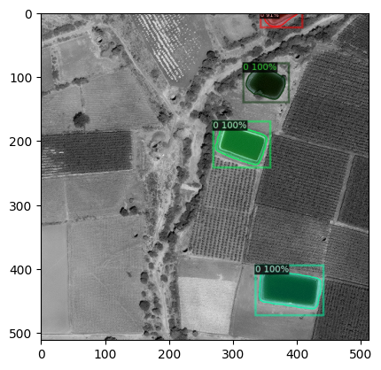

# ponds

Farmponds is a repository for an workflow that can recognize farm ponds based on satellite images from in Western India. Our goal is to provide a easy and straight forward application for environmental researchers, NPOs and local governments to easily asses the impact of climate change on agriculture and its societal impact. This workflow can also be modified to recognize objects other than farm ponds based on the user's input.

We developed the computer vision pipeline based on pre-trained models and created a framework that includes data preprocessing, model training, and georeferencing for users to monitor instances such as farm ponds without extensive labor.

### What you need and what to expect (I/O): 
- Need: A satellite image (orthorectified and color balanced). We recommend a TIF image that has coordinates (Default: EPSG:4326 WGS 84). TIFs with Ground Control Points (GCPs) are recommended so the georeferencing will be more accurate. The GCPs are not necessary if you have access to georeference the data with commericial GIS software.

- Product: A spreadsheet (CSV) with number, location and area estimates of the objects that you are interested in the area; also a image (png) of the instances in the area. 

### How the pipeline works:
For this demonstration, we will use farm ponds in Kadwanchi as an example. You can change the ponds to any other you are interested in labeliung in the region. The pipeline is visualized in Figure 1 below. The goal is to create a dataset that is made of tiles from the satellite image, and then train the neural network based on the dataset, and then merge the tiles and produce the pond counts in the area.

1. **Create a mask for training**: We create tranining data by using image processing software like Adobe Photoshop to label the target object manually on the satellite images.
2. **Segment image/mask into tiles**: We preprocess the data by cutting image and the mask into tiles, and split them into two datasets: Train and Validation. 
3. **Train the neural network**: Once we have preprocessed the data, we train and finetune the models. This is to make sure that the neural network has the best performance. 
4. **Stiching the tiles together**: The neural networks make predictions based on the tiles. We stich the tiles together to get a large mask that covers all the regions in the satellite image. 
5. **Georeferencing**: After producing the predictions in the output folder, we can realign the mask so that the ponds match their locations on a map (See also **Geolocating the ponds** section below). 
5. **Counting instances and estimating area**: We then run an analysis to count the ponds and estimate the area. Our algorithm does this by counting the closed contours of the ponds and estimates the area.

Figure 1: The Farmponds pipeline

Figure 2: Example Prediction 

### Geolocating the ponds 
Georefercing the a part of the pipeline to make sure that the labeled farm ponds are geolocated accurately. To get the best results, the current version of georeferencing.py in the package requires manually entered Ground Control Points (GCPs). If you do not have GCPs, we recommend using GIS software such as QGIS to manually georeference the raster instead. 
Please see the georeferencing tutorial for QGIS here: [https://docs.qgis.org/3.34/en/docs/user_manual/working_with_raster/georeferencer.html](https://docs.qgis.org/3.34/en/docs/user_manual/working_with_raster/georeferencer.html)

