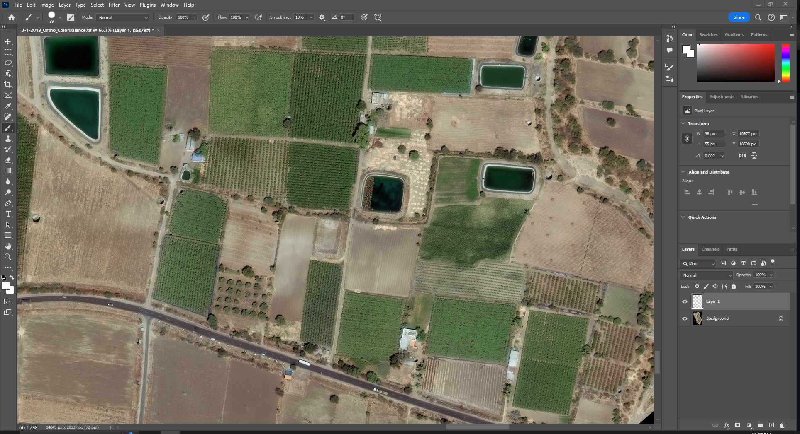
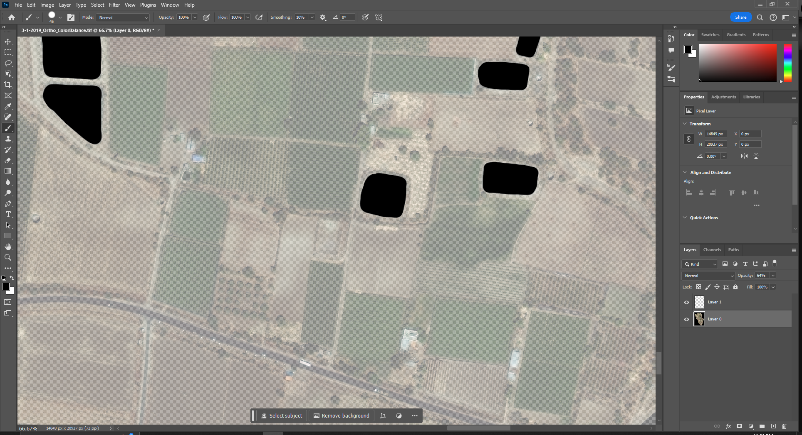
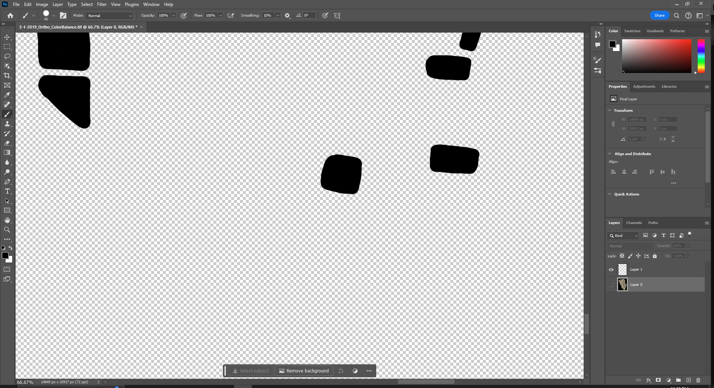

# How to prepare the training data set from a satellite image. 
## What you need:
1. A satellite image (TIF and PNG). A TIF file provides the information of the location of the image is in the image data. PNG or JPEG fiiles will not have the geolocation data but you can still create masks for training and indentify objects. The results will just be without the geolocation.  

## STEP 1: Create Masks for Training

### Farm ponds
The first step is to create labels for the training data. You can choose any object you are interested in analyzing. Here in the example we use farm ponds. To count and estiamte the surface area of artificial farm ponds, we need to color the farm ponds on the image so that the machine learning algorithm can recognize the ponds. 

Use a photo editing software to create the training mask file. Any image processing software that supports layers should work. Common commerical editing software are Adobe Photoshop and GIMP. 

1. In Adobe Photoshop, open the satellite PNG file. 

2. Add a new layer. Make sure the the new blank layer is on top of the satellite image layer. Rename this layer "mask." 
3. Switch to the satellite image layer by clicking on the panel. Adjust the opacity of the satellite image layer to about 75% so that you can still see the ponds on the map.

4. Switch to the mask layer. Color the farm ponds. Adjust the opacity of the satellite image layer on the panel to make sure that the instance you colored matches the farm pond area on the sattelite image. 

4. Label as many instances as you want. You don't have to label all the ponds. More labeled instances are better for training the machine learning model. However, labelling all the ponds requires more time so here we choose to label about 100 farm ponds in the Kadwanchi region.
5. Once done with labeling the ponds, click on the "eye" icon for the satellite image layer to make it invisible. Click on "File" → "Export" → "Export As" and export the file as input_mask.png. The dimensions should match the original input dimensions (for example, our image is 14849x20937)

 6. Put the original satellite image in this same folder alongside the input_mask.png. Name the original satellite image as input.png.  

Now we are ready for cutting the tiles and preprocessing the data in the next step.